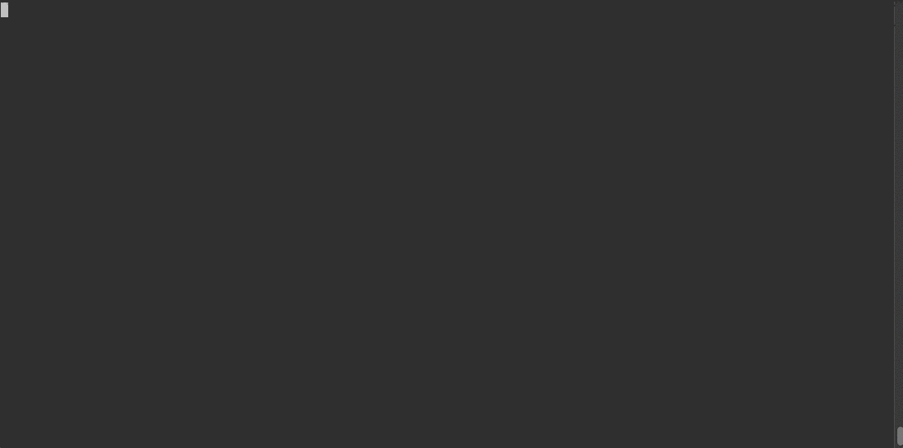

# android-socket.io-sample
[](https://kotlinlang.org/)
[](https://github.com/ReactiveX/RxKotlin)
[](https://github.com/google/dagger)

This is a simple project of TicTacToe using socket.io with node.js


## Don't Forget

Don't forget to run the server


### Looking for a sample MVVM architectured project with Dagger2?
- [Check here](https://github.com/abiramee/mvvm-rxkotlin-sample-code)

### Looking for a Android libraby which can convert custom layout to Image?
- [Check here](https://github.com/abiramee/ImageFromLayout)

### Let's get connected
- [LinkedIn](https://www.linkedin.com/in/abiramee/)
- [Facebook](http://facebook.com/hossain.amee)

### License
```
  Copyright (c) 2020 Abir Hossain Amee

  Permission is hereby granted, free of charge, to any person obtaining a copy
  of this software and associated documentation files (the "Software"), to deal
  in the Software without restriction, including without limitation the rights
  to use, copy, modify, merge, publish, distribute, sublicense, and/or sell
  copies of the Software, and to permit persons to whom the Software is
  furnished to do so, subject to the following conditions:

  The above copyright notice and this permission notice shall be included in all
  copies or substantial portions of the Software.

  THE SOFTWARE IS PROVIDED "AS IS", WITHOUT WARRANTY OF ANY KIND, EXPRESS OR
  IMPLIED, INCLUDING BUT NOT LIMITED TO THE WARRANTIES OF MERCHANTABILITY,
  FITNESS FOR A PARTICULAR PURPOSE AND NONINFRINGEMENT. IN NO EVENT SHALL THE
  AUTHORS OR COPYRIGHT HOLDERS BE LIABLE FOR ANY CLAIM, DAMAGES OR OTHER
  LIABILITY, WHETHER IN AN ACTION OF CONTRACT, TORT OR OTHERWISE, ARISING FROM,
  OUT OF OR IN CONNECTION WITH THE SOFTWARE OR THE USE OR OTHER DEALINGS IN THE
  SOFTWARE.

 ```
